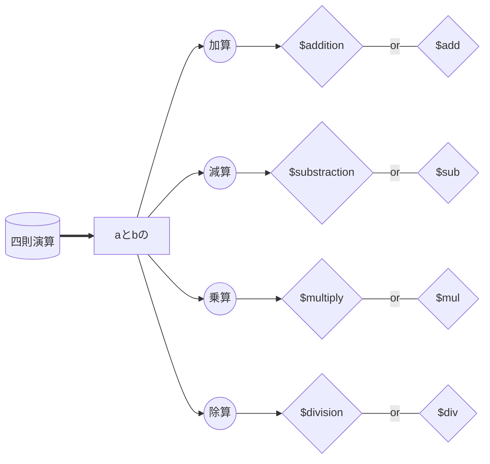
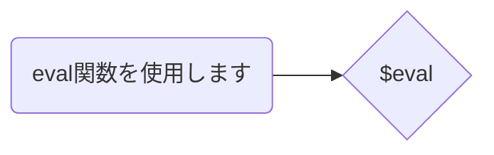

# SIGES BOT取扱説明書

開発環境:rpi4(8gb) python v3.7.3
必要用件:python v3.7.3

## -必要permission-

OAuth2:

```bash
BOT
```

Bot:

```bash
General
| View Channels
Text
| Send Messages
| Embed Links
| Read Message History
| Use External Emojis
| Add Reactions
```

招待リンク `https://discord.com/api/oauth2/authorize?client_id=<Your Bot Application ID>&permissions=271666256&scope=bot`

## -起動-

```python
DISCORD_BOT_TOKEN=<YOUR BOT TOKEN>
python3 discordbot.py
```

## -botｺﾏﾝﾄﾞ-

### メインコマンド

```Ruby
$help : 使用可能コマンドを確認できます
```

```Ruby
$info : SIGES BOTの各種情報を表示します
```

```Rb
$cat : ﾈｺ
```





`$splityen($spy)`:入力金額から金種(硬貨や札の種類)を分類します

※日本円限定

`$combineyen($com)`:入力された各金種の枚数から合計金額を算出します

※日本円限定

`$question`:⭕ ❌質問や、**複数選択肢**の質問を作ることができます

## サブコマンド

`$rep|eat\`:\の後ろの文章をBOTが繰り返します。

SIGES BOTメッセージ削除権限がある場合、送信者のメッセージを削除する機能も付いています

`$greet`:あいさつしましょう！

`$number`

`$omikuji`:おみくじ

`$ping`:pong

`$yattaze`:やったぜ

※詳しくは`$question help`で確認できます

## `!!!メンテナンス中!!!`

`$zatu|gaku`:雑学リストを表示します

## -実装予定・実装するかも-

`$list` :ユーザー毎、チャンネル毎、サーバー毎のリストを作成し、辞書をつくる
