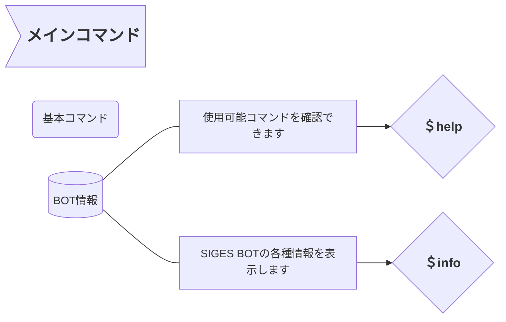
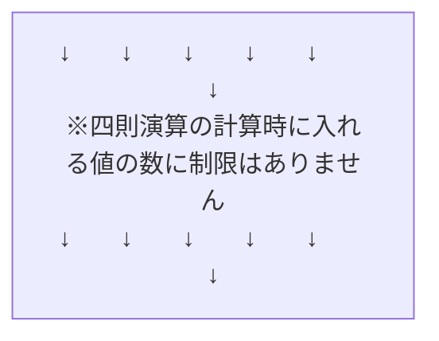
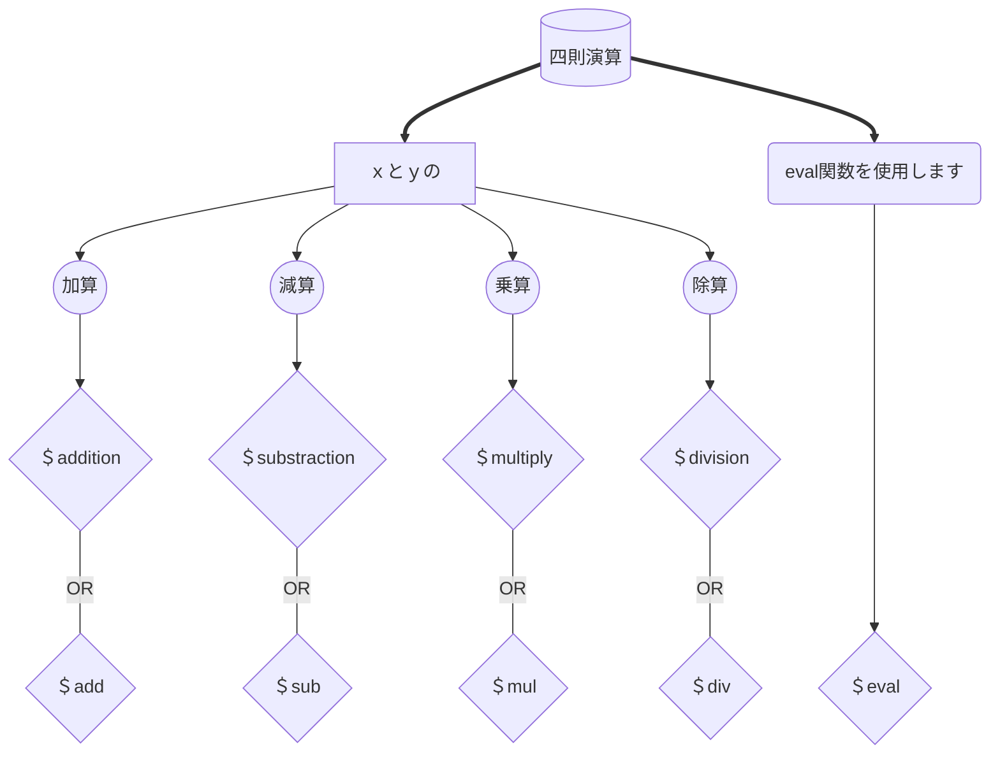
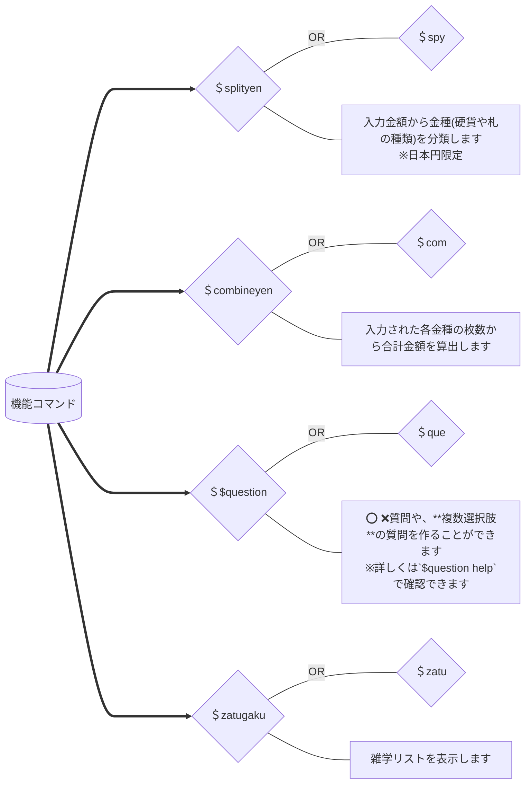
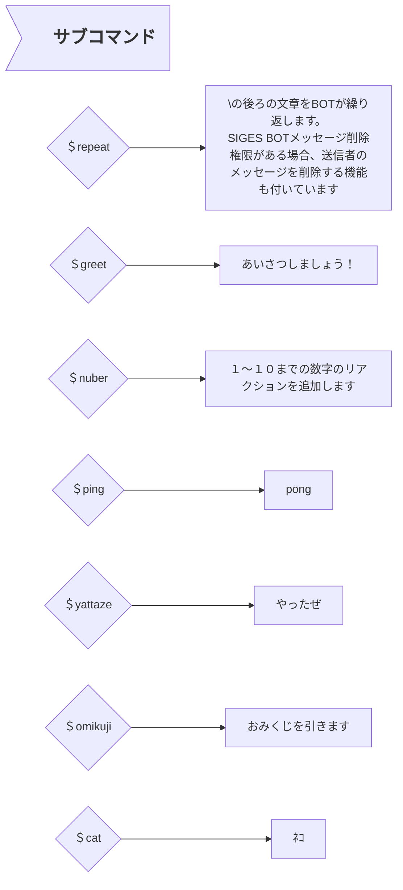

# SIGES BOT取扱説明書

開発環境:rpi4(8gb) python v3.7.3
必要用件:python v3.7.3

## -必要permission-

OAuth2:

```bash
BOT
```

Bot:

```css
General
| View Channels
Text
| Send Messages
| Embed Links
| Read Message History
| Use External Emojis
| Add Reactions
```

## -起動-

```text
DISCORD_BOT_TOKEN=<YOUR BOT TOKEN>
python3 discordbot.py
```

## -botｺﾏﾝﾄﾞ-

##### ※コマンドの文頭には、必ず半角の 「 $ 」 が入ります











## `!!!メンテナンス中!!!`

None

## -実装予定・実装するかも-

`$list` :ユーザー毎、チャンネル毎、サーバー毎のリストを作成し、辞書をつくる
